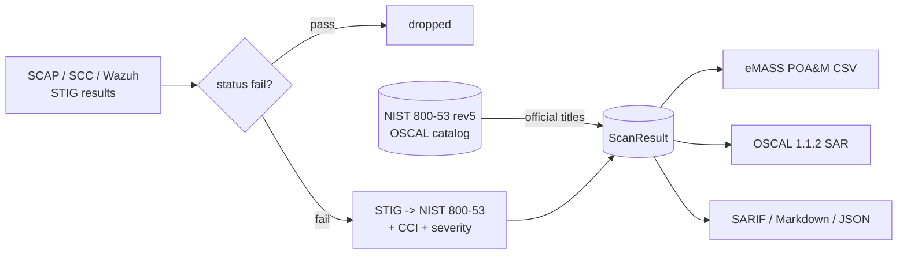

# stigsentry — DISA STIG / NIST 800-53 evidence + POAM

[](https://github.com/cognis-digital/stigsentry/actions)
[](./UPSTREAM.md)

> Ingest SCAP/SCC/OpenSCAP/Wazuh findings → produce eMASS-ready POAM + OSCAL Assessment Results.


<!-- cognis:example:start -->
## 🔎 Example output

Real, reproducible output from the tool — runs offline:

```console
$ stigsentry-emit --version
stigsentry 0.2.0
```

```console
$ stigsentry-emit --help
usage: stigsentry [-h] [--format {console,json,markdown,sarif,oscal}]
                  [--out OUT] [--fail-on {very_high,high,moderate,low,none}]
                  [--classification CLASSIFICATION] [-v]
                  [target]

stigsentry — Cognis Digital · Military/IC ecosystem

positional arguments:
  target                Path/target

options:
  -h, --help            show this help message and exit
  --format {console,json,markdown,sarif,oscal}
  --out OUT             Write output to file
  --fail-on {very_high,high,moderate,low,none}
  --classification CLASSIFICATION
                        Operator-supplied banner. PLACEHOLDER. Tool does not
                        interpret.
  -v, --version         show program's version number and exit
```

> Blocks above are real `stigsentry` output — reproduce them from a clone.

**Sample result format** _(illustrative values — run on your own data for real findings):_

```
{
  "stigsentry": {
    "platform": "STIX",
    "findings": [
      {
        "id": "1234567890",
        "title": "Example Finding 1",
        "description": "This is an example finding.",
        "indicators": [
          {
            "type": "IPv4-Address",
            "value": "192.168.1.100"
          }
        ]
      },
      {
        "id": "2345678901",
        "title": "Example Finding 2",
        "description": "This is another example finding.",
        "indicators": [
          {
            "type": "Domain-Name",
            "value": "example.com"
          }
        ]
      }
    ]
  }
}
```

<!-- cognis:example:end -->

## Usage — step by step

`stigsentry` uses the shared `cognis_mil` CLI: a positional target plus
standard output/scoring flags.

1. **Install** (editable from a clone, or from the wheel):
   ```bash
   pip install -e .
   # provides the `stigsentry` console script
   ```
2. **Run the primary scan** against a path or target (defaults to `.`):
   ```bash
   stigsentry .
   ```
3. **Emit machine-readable output** — `console|json|markdown|sarif|oscal`:
   ```bash
   stigsentry ./target --format json --out stigsentry-report.json
   ```
4. **Read / use the output.** The JSON report carries the findings list and a
   severity-weighted `composite_score`; `sarif` feeds code-scanning dashboards
   and `oscal` emits a real **OSCAL 1.1.2 Assessment Results** document
   (deterministic UUIDs, observation+finding pairs, NIST control targets with
   `not-satisfied` status, STIG/CCI/ATT&CK props) — ingestible by GRC platforms. An operator
   `--classification` banner can be stamped on (placeholder only):
   ```bash
   stigsentry ./target --classification "UNCLASSIFIED//FOR PUBLIC RELEASE" --format markdown
   ```
5. **Gate CI on severity** with `--fail-on` (`very_high|high|moderate|low|none`);
   the process exits non-zero when a finding at/above the threshold exists:
   ```bash
   stigsentry ./target --format sarif --out stigsentry.sarif --fail-on high
   ```

## Upstream

Forks / wraps **https://github.com/wazuh/wazuh**. See [`UPSTREAM.md`](./UPSTREAM.md) for the
licensing posture, supported commits, and how to upgrade.

## What this adds for military / IC use

- STIG → NIST 800-53 crosswalk
- CCI + MITRE ATT&CK enrichment
- POAM CSV for eMASS / Xacta / RSA Archer
- OSCAL 1.1.2 Assessment Results JSON (real, validatable — not a skeleton)

## Install

```bash
# Shared library (only once for the whole ecosystem):
pip install -e ../../shared

# This tool:
pip install -e .
```

## Demo

```bash
stigsentry demos/scap-results.json
```

Outputs are available in five formats — all respect an operator-supplied
classification banner (passed via `--classification`):

```bash
stigsentry <target> --format=console     # default
stigsentry <target> --format=json
stigsentry <target> --format=sarif       # for code-scanning pipelines
stigsentry <target> --format=markdown    # for PRs / briefings
stigsentry <target> --format=oscal       # real OSCAL 1.1.2 Assessment Results (GRC-ingestible)
```

## Demos

Five runnable, **fully offline** scenarios in [`demos/`](./demos/), each aimed at a
different federal-compliance audience. They re-scan the bundled sample enclave and
resolve NIST 800-53 titles from a bundled OSCAL snapshot, so they reproduce
byte-for-byte on a disconnected box. Full write-up in [`docs/DEMOS.md`](./docs/DEMOS.md).

```bash
PYTHONUTF8=1 python demos/run_all.py        # all five, end to end (exit 0)
PYTHONUTF8=1 python demos/02_isso_poam.py    # or just one
```

| # | Scenario | Audience | What it shows |
|---|----------|----------|---------------|
| 1 | [`01_sysadmin_scan.py`](./demos/01_sysadmin_scan.py) | Sysadmins | Raw SCAP rows → severity-ranked, per-host fix-first worklist. |
| 2 | [`02_isso_poam.py`](./demos/02_isso_poam.py) | ISSO / ISSM | STIG findings → eMASS POA&M CSV with real NIST Control Title column. |
| 3 | [`03_auditor_oscal.py`](./demos/03_auditor_oscal.py) | Assessors / auditors | Real OSCAL 1.1.2 Assessment Results, deterministic UUIDs. |
| 4 | [`04_ato_risk_brief.py`](./demos/04_ato_risk_brief.py) | ATO / Authorizing Official | Composite risk + control-family rollup + Markdown brief. |
| 5 | [`05_airgap_pipeline.py`](./demos/05_airgap_pipeline.py) | Air-gap / CI | Offline resolve, SARIF export, `--fail-on` build gate. |

The check → map → POA&M flow (full diagram in [`docs/ARCHITECTURE.md`](./docs/ARCHITECTURE.md)):



## Classification banner

All output is wrapped with an operator-supplied classification banner.
**Default**: `UNCLASSIFIED//FOR PUBLIC RELEASE`.

> ⚠️ This tool **does not** generate or validate the *content* of higher
> classifications. Operators on cleared systems supply real markings at runtime.
> See [`../shared/cognis_mil/classmark.py`](../../shared/cognis_mil/classmark.py).

## Compliance crosswalks (built in)

Every finding can carry references to:
- **NIST 800-53 Rev 5** controls (e.g. `AC-2(1)`)
- **DISA STIG** rule IDs (e.g. `V-242414`)
- **MITRE ATT&CK** technique IDs (e.g. `T1078`)
- **CCI** (Control Correlation Identifier)

These are emitted in JSON, SARIF, and real OSCAL 1.1.2 Assessment Results.

## Live data feed — NIST 800-53 rev5 (OSCAL), edge / air-gap deployable

A STIG finding maps to a NIST control **ID** like `AC-6(2)` — opaque on a POAM.
stigsentry ingests the **authoritative NIST SP 800-53 rev5 catalog** (native
OSCAL JSON, published by NIST) and resolves each control ID to its **official
title** and OSCAL family, so reports carry the real control name. This is a
genuine enrichment: every scan adds `nist_800_53_controls_resolved` to the
result metadata, weaves the title into each finding's description, and the
eMASS POAM gains a **Control Title** column.

Real source (keyless, no API key):

| feed id | source |
|---|---|
| `oscal-800-53-rev5-catalog` | NIST SP 800-53 rev5 catalog (OSCAL) — `https://raw.githubusercontent.com/usnistgov/oscal-content/main/nist.gov/SP800-53/rev5/json/NIST_SP-800-53_rev5_catalog.json` |

The ingestion layer (`stigsentry/datafeeds.py` + the bundled
`data_feeds_2026.json` catalog) is **standard-library only** — it fetches over
HTTPS, caches to disk (`COGNIS_FEEDS_CACHE`, default `~/.cache/cognis-feeds`),
and re-serves the catalog **offline** so disconnected / edge / air-gapped gear
keeps working.

```bash
# list the compliance feeds stigsentry consumes (filtered to its domain)
stigsentry feeds list

# fetch + cache the NIST OSCAL catalog (one live pull)
stigsentry feeds update oscal-800-53-rev5-catalog

# re-serve from cache only — never touches the network
stigsentry feeds get oscal-800-53-rev5-catalog --offline
```

### Air-gap / sneakernet workflow

On a connected host, pull and snapshot the cache, carry it across, import it:

```bash
# connected enclave
stigsentry feeds update oscal-800-53-rev5-catalog
python -m stigsentry.datafeeds snapshot-export feeds.tar.gz

# air-gapped enclave (copy feeds.tar.gz over, then)
python -m stigsentry.datafeeds snapshot-import feeds.tar.gz
stigsentry feeds get oscal-800-53-rev5-catalog --offline   # works, no network
```

The scan itself runs the enrichment automatically; pass it through offline:

```bash
COGNIS_FEEDS_CACHE=./feed-cache stigsentry demos/scap-results.json
python demos/enrich_oscal_demo.py        # fully offline against the bundled snapshot
```

Tests never hit the network: a trimmed snapshot of the real catalog lives under
`tests/fixtures/` and the suite serves it via `COGNIS_FEEDS_CACHE` + `offline=True`.

## CI / RMF integration

```yaml
- name: stigsentry scan
  run: |
    pip install cognis-stigsentry
    stigsentry . --format=oscal --out=assessment-results.json --fail-on=high
- name: Upload to eMASS/Xacta
  run: cognis-rmf-package import assessment-results.json
```

## Part of the Cognis Digital military / IC ecosystem

12 repos. All MIT/COCL (Cognis Open Collaboration License)/GPL-3 (per upstream). Cognis additions are
COCL (Cognis Open Collaboration License) unless stated otherwise.

See [the master index](../../MASTER-INDEX.md).

## Interoperability

`stigsentry` composes with the 300+ tool Cognis suite — JSON in/out and a shared
OpenAI-compatible `/v1` backbone. See **[INTEROP.md](INTEROP.md)** for the
suite map, composition patterns, and reference stacks.

## Integrations

Forward `stigsentry`'s findings to STIX/MISP/Sigma/Splunk/Elastic/Slack/webhooks via
[`cognis-connect`](https://github.com/cognis-digital/cognis-connect). See **[INTEGRATIONS.md](INTEGRATIONS.md)**.
