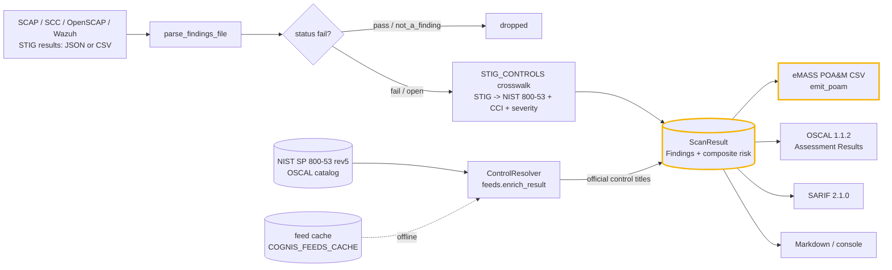
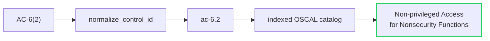

# Architecture

`stigsentry` turns raw SCAP/SCC/OpenSCAP/Wazuh STIG findings into RMF evidence: it
**checks** the findings, **maps** each one to its NIST 800-53 control (with the
official control title resolved from the authoritative OSCAL catalog), and emits
the **POA&M** / OSCAL Assessment Results an ATO package needs. This document
explains how the pieces fit together, end to end.

## The check → map → POA&M flow

## Components

### Crosswalk + scanner (`stigsentry/core.py`)
`scan()` walks the target directory's `*.json` / `*.csv` SCAP results, parses each
file (`parse_findings_file`), drops passing rows, and maps every open finding
through the `STIG_CONTROLS` crosswalk to a NIST 800-53 control ID, CCI, and
NIST 800-30-style severity. Unknown STIG IDs are preserved as low findings (never
silently dropped). The result is a `ScanResult` carrying the findings and a
severity-weighted composite risk score.

### Control resolver / data feeds (`stigsentry/feeds.py`, `datafeeds.py`)
A NIST control **ID** (`AC-6(2)`) is opaque on a POA&M. `ControlResolver` ingests
the authoritative **NIST SP 800-53 rev5 OSCAL catalog**, normalizes report-form
IDs (`AC-6(2)` → `ac-6.2`) to catalog form, and resolves each to its official
**title** and OSCAL family. `enrich_result()` weaves those titles into the result.

### Edge / air-gap caching (`stigsentry/datafeeds.py`)
The catalog is fetched once over HTTPS and cached to disk (`COGNIS_FEEDS_CACHE`,
default `~/.cache/cognis-feeds`). Thereafter `offline=True` re-serves the cached
snapshot with **no network**, so disconnected / air-gapped gear keeps working.
`snapshot-export` / `snapshot-import` sneakernet the cache across an air gap.

### Exporters (`cognis_mil/exporters.py`)
One `ScanResult` renders five ways: `console` (operator view), `json`,
`sarif` (code-scanning dashboards), `markdown` (PRs / briefings), and `oscal` — a
real **OSCAL 1.1.2 Assessment Results** document with deterministic uuid5 UUIDs,
paired observation+finding records, `not-satisfied` control targets, and
STIG/CCI/ATT&CK preserved as props. `emit_poam()` (core) renders the eMASS POA&M
CSV with the resolved **Control Title** column.

### Severity & scoring (`cognis_mil/models.py`)
`Finding` / `ScanResult` with a NIST 800-30-style severity model
(`very_high … very_low`) and weights. `finalize()` computes the composite risk
score (0–100) and risk level the AO reads at a glance.

### CLI (`stigsentry/cli.py`)
The shared `make_cli` exposes `--format {console,json,markdown,sarif,oscal}`,
`--out`, `--fail-on`, and a `--classification` banner (placeholder only — the tool
does not interpret classification). A dedicated `feeds` subcommand drives the
data-feed layer (`feeds list|update|get --offline`).

## Why these choices

- **Offline by construction.** The OSCAL catalog is a cached file; every scan,
  resolve, and export runs without the network. The same flow works air-gapped.
- **Standard library only.** No heavy dependencies; the feed layer is pure stdlib
  HTTPS + disk cache. The graph of evidence is a file you can copy and diff.
- **Deterministic evidence.** OSCAL UUIDs are uuid5 over stable inputs, so the same
  findings re-export byte-identical — an assessor can diff two assessment runs.
- **Provenance preserved.** STIG rule ID, CCI, ATT&CK, and the NIST control ride
  through every format, so the POA&M and the SAR trace back to the source rule.
